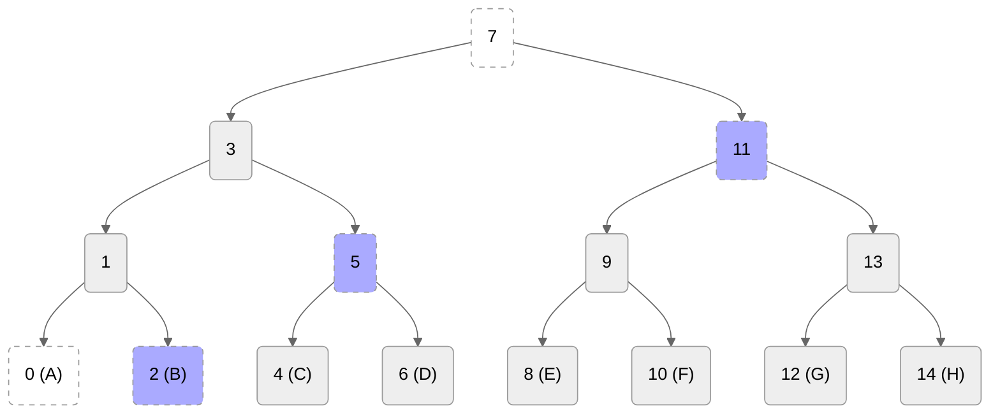
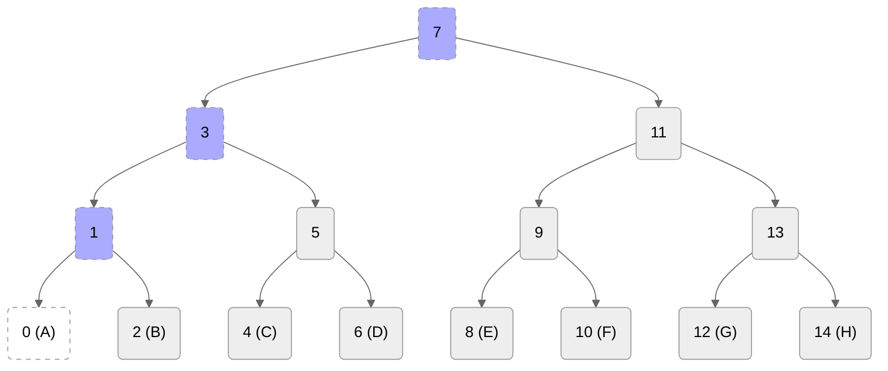
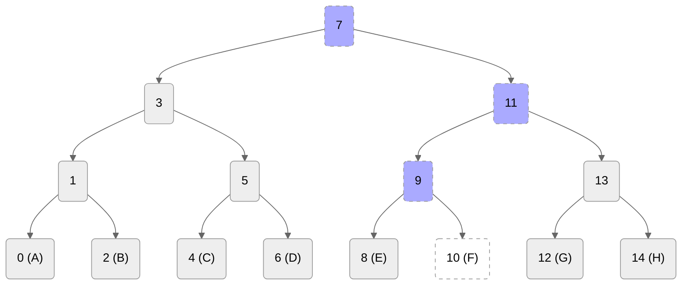
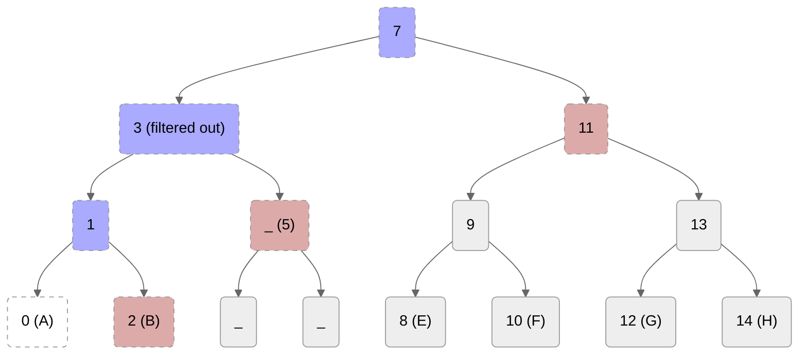
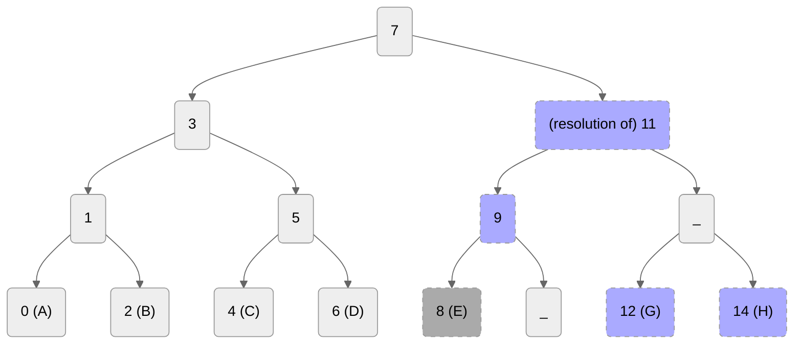

# MLS Dictionary (draft-ietf-mls-protocol-16)

## C

<details>
  <summary><a name="concept_commit">Commit</a></summary>
  
...
</details>

<details>
  <summary><a name="concept_commit_secret">Commit secret</a></summary>
  
  `path_secret[n+1]`
</details>

<details>
  <summary><a name="concept_confirmation_tag">Confirmation tag</a></summary>
  
  A MAC over the [confirmed transcript hash](#concept_confirmed_transcript_hash) (calculated by using the `confirmation_key`).
  It confirms that the members of the group have arrived at the same state of the group, because the confirmed transcript hash covers every commit and (although indirectly) every proposal.
</details>

<details>
  <summary><a name="concept_confirmed_transcript_hash">Confirmed transcript hash</a></summary>
  
  A running (chained) hash over the whole history of `Commit` messages including the most recent `Commit`. 
  `Proposal`s are indirectly included through the `ProposalRef`s in the `Commit` that applied them.
  The hash of a `Commit` (and a `Proposal` to obtain a `ProposalRef`) is calculated over the `MLSAuthenticatedContent` in which it was sent.
</details>

<details>
  <summary><a name="concept_copath">Copath (of a node)</a></summary>
  
  The copath of a node is the node's sibling concatenated with the list of siblings of all the nodes in its direct path, excluding the root.
  

  ### Example (A):


  
</details>

## D

<details>
  <summary><a name="concept_descendants">Descendants (of a node)</a></summary>
  
  ...
</details>

<details>
  <summary><a name="concept_direct_path">Direct path (of a node)</a></summary>
  
  The direct path of a root is the empty list, and of any other node is the concatenation of that node's parent along with the parent's direct path.
  
  ### Example (A):


  
  ### Example (F)
  

  
</details>

## E

<details>
  <summary><a name="term_empty_commit">"Empty" commit</a></summary>

  A commit that references no proposals.
</details>

<details>
  <summary><a name="concept_external_commit">External commit</a></summary>
  
  A mechanism for new members (external parties that want to become members of the group) to add themselves to a group, without requiring that an existing member has to come online to issue a Commit that references an Add Proposal. New members can create an External Commit if they have access to the current [group info](#structure_group_info) (that contains an [`external_pub` extension](#extension_external_pub)). External Commits work like regular Commits, however, their content has to meet a specific set of requirements.
</details>

<details>
  <summary><a name="proposal_external_init">ExternalInit (<a href="#concept_proposal">Proposal</a>)</a></summary>
  
  A proposal used by new members to join a group by using an [external commit](#concept_external_commit). This proposal can only be used in that context.
</details>

<details>
  <summary><a name="extension_external_pub"><code>external_pub</code> (extension)</a></summary>

  A [group info](#structure_group_info) extension required to allow external commits.
</details>

## F

<details>
  <summary><a name="concept_filtered_direct_path">Filtered direct path (of a node)</a></summary>
  
  The filtered direct path of a leaf node L is the node's [direct path](#concept_direct_path), with any node removed whose child on the [copath](#concept_copath) of L has an empty [resolution](#concept_resolution).
  
  
  Idea: The removed nodes do not need their own key pairs because encrypting to the node's key pair would be equivalent to encrypting to its non-copath child.

  ### FAQ
  
  * "Which child on the copath of L? Arn't there always two children?" -> There is exactly one "child on the copath of L", thus we do not to say which one, left or right. The picture below makes this clearer.

  ### Example (A)

* `[1, 3] == direct_path(0)`
* `[2, 5, 11] == copath(0)`

* `[1] == filtered_direct_path(0)`



</details>

<details>
  <summary><a name="term_full_commit">"Full" commit</a></summary>
  
  A [commit](#concept_commit) that contains a `path` field (see [Update path](#concept_update_path)).
</details>

## G

<details>
  <summary><a name="structure_group_info">Group info</a></summary>
  
  A structure that holds information to bootstrap a local group state when joining through a [Welcome] or an [External Commit].
   
  Two extensions are allowed:
  * [`external_pub`](#extension_external_pub): The public key `external_pub` can be published in the `external_pub` extension to allow non-members to join the group using an external commit.
  * [`ratchet_tree`](#extension_ratchet_tree): By default, a group info only provides the joiner with a hash of the group's ratchet tree. Thus, the joiner will need to get a copy of the ratchet tree from some source. With this extensions the ratchet tree can be included directly in the group info.

  Previous names:
  * ~PublicGroupState (PGS)~
</details>

## I

<details>
  <summary><a name="concept_interim_transcript_hash">Interim transcript hash</a></summary>
  
  A hash that covers the [confirmed transcript hash](#concept_confirmed_transcript_hash) plus the [confirmation tag](#concept_confirmation_tag) of the most recent Commit.
</details>

## K

<details>
  <summary><a name="key_package">Key package</a></summary>
  
  A (signed) data structure containing (pre-published) public information about a user. Notably, it contains a public key ("init key") that others can use to encrypt a [Welcome message] to this user. It also contains the content of the [leaf node] that should be added to the tree representing the user.
</details>

## P

<details>
  <summary><a name="term_partial_commit">"Partial" commit</a></summary>

  A commit that references proposals that do not require a path, and where the path is empty (see [Update path](#concept_update_path)).
</details>

<details>
  <summary><a name="concept_proposal">Proposal</a></summary>
  
...
</details>

## R

<details>
  <summary><a name="extension_ratchet_tree"><code>ratchet_tree</code> (extension)</a></summary>
  
  A [group info](#structure_group_info) extension that holds the ratchet tree used for [welcome] or [external commits].
</details>

<details>
  <summary><a name="concept_resolution">Resolution (of a node)</a></summary>
  
  An ordered list of non-blank nodes that collectively cover all non-blank [descendants](#concept_descendants) of the node.

  Alternativ: A depth-first, left-first enumeration of the *nearest* non-blank nodes that "collectively cover" all non-blank descendants. Collectively cover means that the covering node is an ancestor of every covered node.
  
  Note: The resolution of a non-blank node comprises the node itself, followed by its list of unmerged leaves, if any.
  
  ### Example (resolution of 11)



</details>

## T

<details>
  <summary><a name="concept_tree_invariant">Tree invariant</a></summary>
  
  The private key for a node in the tree is known to a member of the group only if the node's subtree contains that member's leaf.
</details>

## U

<details>
  <summary><a name="concept_unmerged_leaf">Unmerged leaf</a></summary>
  
  The unmerged leaves array is a bookkeeping procedure to remember leaves that were added after a node was last updated.
  Used in resolution and parent-hash verification. (Description shamelessly copied from an email Théophile Wallez wrote to mls@ietf.org.)
</details>

<details>
  <summary><a name="concept_update_path">Update path</a></summary>
  
  An `UpdatePath` is a structure that contains all information required to process an update from another member.
  Notably, it contains the new leaf node and all public keys for the (filtered) direct path of the sender that issued the update.
  However, it also contains private HPKE keys for the updated nodes in an encrypted form such that they can only be decrypted by the correct members.

  ```c
  struct {
      opaque kem_output<V>;
      opaque ciphertext<V>;
  } HPKECiphertext;

  struct {
      HPKEPublicKey encryption_key; // Public HPKE key for updated node.
      HPKECiphertext encrypted_path_secret<V>; // Private HPKE key for updated node (encrypted multiple times to all "appropriate" members.)
  } UpdatePathNode;

  struct {
      LeafNode leaf_node; // The updated (new) leaf node.
      UpdatePathNode nodes<V>;
  } UpdatePath;

  struct {
      ProposalOrRef proposals<V>;
      optional<UpdatePath> path;
  } Commit;
  ```
  
  Only add, psk, reinit proposals do not require path.
  
</details>
